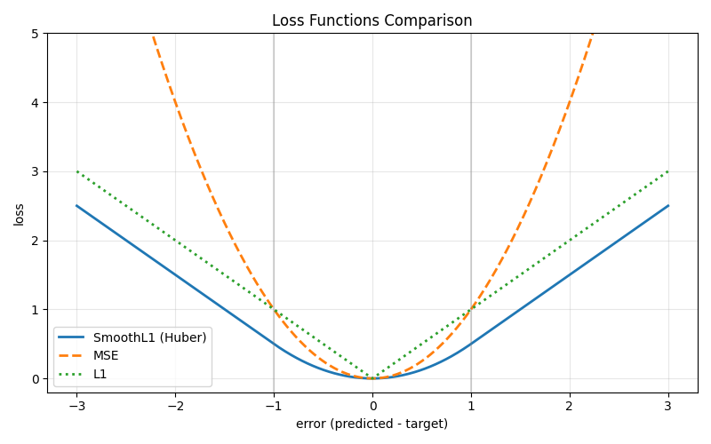

# Loss Functions in DQN

## Overview

In DQN, the loss function measures the gap between the current Q-value prediction and the TD target. Choosing the right loss function affects training stability and convergence speed.

## MSE Loss (Mean Squared Error)

$$L = \frac{1}{N} \sum_{i=1}^{N} (y_i - \hat{y}_i)^2$$

- Gradient: $\frac{\partial L}{\partial \hat{y}} = -2(y - \hat{y})$
- When error is large, gradient is proportionally large — can cause gradient explosion
- Penalizes large errors quadratically

**Characteristics:**
- Near zero error: gradient is smooth, converges well
- Large error: gradient grows without bound, training can become unstable
- Very sensitive to outliers

## L1 Loss (Mean Absolute Error)

$$L = \frac{1}{N} \sum_{i=1}^{N} |y_i - \hat{y}_i|$$

- Gradient: $\frac{\partial L}{\partial \hat{y}} = \text{sign}(\hat{y} - y) = \pm 1$
- Gradient is constant regardless of error magnitude — robust to outliers
- Linear growth, no explosion at large errors

**Characteristics:**
- Near zero error: gradient is constant (not smooth), can oscillate around the optimum
- Large error: gradient is capped at 1, stable
- The non-smooth point at zero is its main drawback — the optimizer cannot slow down gracefully near the minimum

## Smooth L1 Loss (Huber Loss)

$$L = \begin{cases} \frac{1}{2}(y - \hat{y})^2, & |y - \hat{y}| < 1 \\ |y - \hat{y}| - \frac{1}{2}, & \text{otherwise} \end{cases}$$

- When error < 1: behaves like MSE (smooth, good convergence near zero)
- When error >= 1: behaves like L1 (gradient capped at 1, prevents explosion)
- The $-\frac{1}{2}$ offset ensures the two segments connect seamlessly at the boundary

**Characteristics:**
- Combines MSE's smooth convergence near zero with L1's stability at large errors
- Built-in gradient clipping at the loss level

## Comparison

| Property | MSE | L1 | Smooth L1 |
|----------|-----|-----|-----------|
| Gradient at large error | Unbounded | Bounded (constant = 1) | Bounded (constant = 1) |
| Gradient at small error | Smooth, approaches 0 | Constant (not smooth) | Smooth, approaches 0 |
| Sensitivity to outliers | High | Low | Low |
| Convergence near optimum | Good | Poor (oscillates) | Good |
| Training stability in RL | Poor (TD targets are noisy) | Moderate | Good |

## Why Smooth L1 is Preferred in DQN

TD targets ($r + \gamma \max Q'$) are noisy estimates that fluctuate during training. MSE amplifies these large errors into huge gradients, destabilizing learning. Pure L1 is stable but oscillates near the optimum. Smooth L1 caps the gradient at 1 for large errors (like L1) while maintaining smooth convergence near zero (like MSE) — the best of both worlds.

---

# DQN 中的损失函数

## 概述

在 DQN 中，损失函数衡量当前 Q 值预测与 TD 目标之间的差距。选择合适的损失函数会影响训练稳定性和收敛速度。

## MSE 损失（均方误差）

$$L = \frac{1}{N} \sum_{i=1}^{N} (y_i - \hat{y}_i)^2$$

- 梯度：$\frac{\partial L}{\partial \hat{y}} = -2(y - \hat{y})$
- 误差大时，梯度也大——可能导致梯度爆炸
- 对大误差施加二次惩罚

**特点：**
- 接近零误差时：梯度平滑，收敛好
- 大误差时：梯度无界增长，训练可能不稳定
- 对异常值非常敏感

## L1 损失（平均绝对误差）

$$L = \frac{1}{N} \sum_{i=1}^{N} |y_i - \hat{y}_i|$$

- 梯度：$\frac{\partial L}{\partial \hat{y}} = \text{sign}(\hat{y} - y) = \pm 1$
- 无论误差多大，梯度恒为常数——对异常值鲁棒
- 线性增长，大误差时不会爆炸

**特点：**
- 接近零误差时：梯度恒为常数（不平滑），容易在最优点附近震荡
- 大误差时：梯度恒为 1，稳定
- 零点处不平滑是其主要缺点——优化器无法在接近最小值时优雅地减速

## Smooth L1 损失（Huber 损失）

$$L = \begin{cases} \frac{1}{2}(y - \hat{y})^2, & |y - \hat{y}| < 1 \\ |y - \hat{y}| - \frac{1}{2}, & \text{otherwise} \end{cases}$$

- 误差 < 1 时：表现像 MSE（平滑，接近零时收敛好）
- 误差 >= 1 时：表现像 L1（梯度恒为 1，防止爆炸）
- $-\frac{1}{2}$ 的偏移是为了让两段函数在边界处无缝衔接

**特点：**
- 结合了 MSE 在零点附近的平滑收敛和 L1 在大误差时的稳定性
- 相当于在损失函数层面内置了梯度裁剪

## 对比

| 特性 | MSE | L1 | Smooth L1 |
|------|-----|-----|-----------|
| 大误差时的梯度 | 无界（与误差成正比） | 有界（恒为 1） | 有界（恒为 1） |
| 小误差时的梯度 | 平滑，趋近于 0 | 恒定（不平滑） | 平滑，趋近于 0 |
| 对异常值的敏感性 | 高 | 低 | 低 |
| 接近最优时的收敛 | 好 | 差（震荡） | 好 |
| RL 中的训练稳定性 | 差（TD 目标有噪声） | 中等 | 好 |

## 为什么 DQN 中优先使用 Smooth L1

TD 目标（$r + \gamma \max Q'$）是有噪声的估计值，训练过程中波动大。MSE 会把这些大误差放大为巨大的梯度，破坏学习稳定性。纯 L1 虽然稳定但在最优点附近会震荡。Smooth L1 在大误差时将梯度限制为 1（像 L1），同时在零点附近保持平滑收敛（像 MSE）——两全其美。
