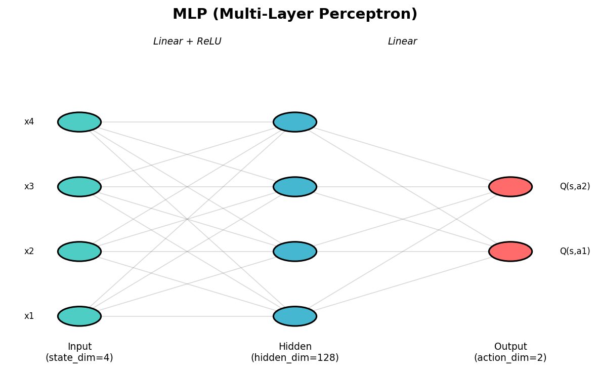
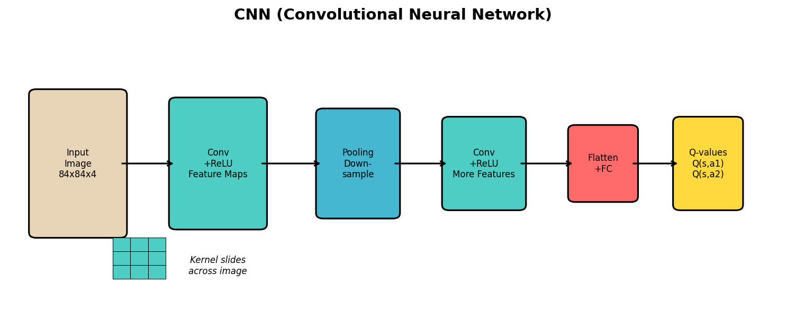
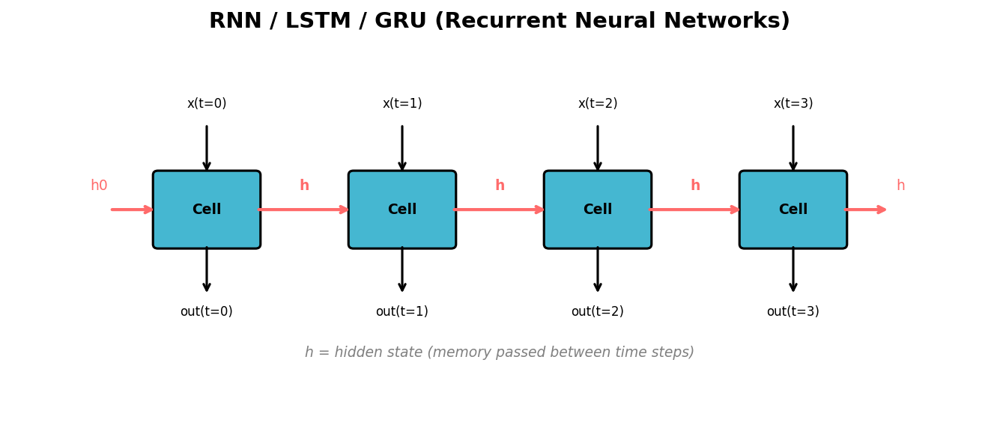
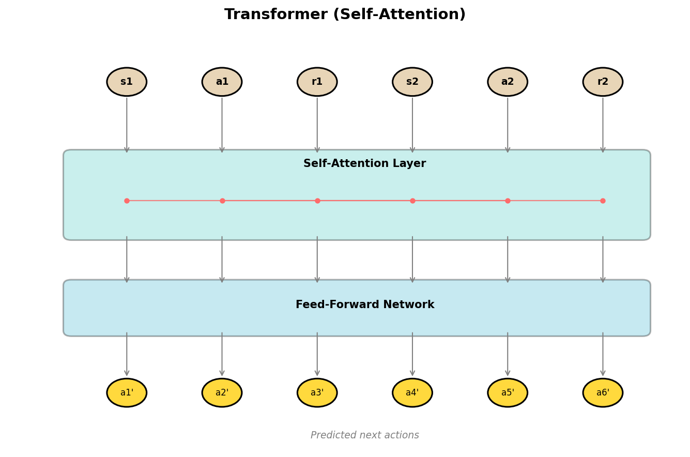
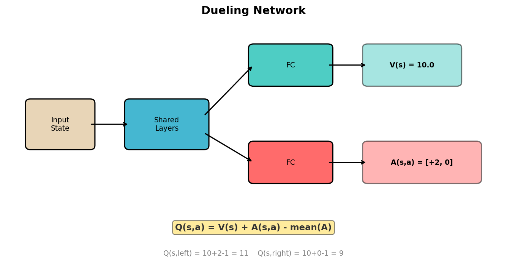
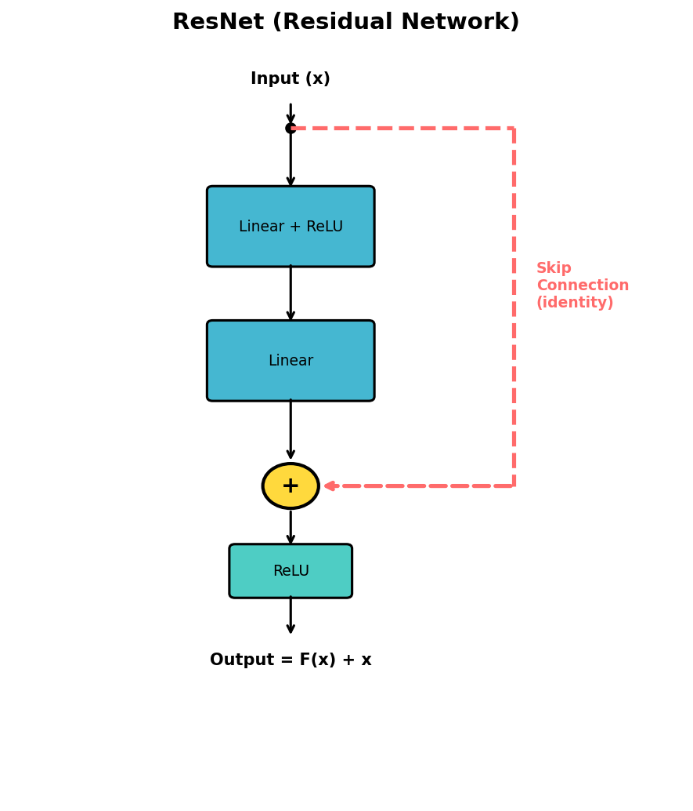

# Neural Network Architectures in RL

## MLP (Multi-Layer Perceptron)

The most basic neural network structure: fully connected layers stacked sequentially. Every neuron in one layer connects to every neuron in the next layer.



**When to use:** Low-dimensional state inputs (e.g., CartPole's 4-dimensional state vector).

**Example (PyTorch):**

```python
nn.Sequential(
    nn.Linear(state_dim, hidden_dim),
    nn.ReLU(),
    nn.Linear(hidden_dim, action_dim),
)
```

## CNN (Convolutional Neural Network)

Uses convolutional kernels to extract local spatial features with parameter sharing. Much more efficient than MLP for high-dimensional spatial inputs.



**When to use:** Image-based inputs (e.g., Atari game pixels, autonomous driving camera frames).

## RNN / LSTM / GRU (Recurrent Neural Networks)

Has memory through hidden states, capable of processing sequential and temporal dependencies.



**When to use:** Partially observable environments (POMDP) where the agent needs memory of past observations.

## Transformer

Uses self-attention mechanisms to capture long-range dependencies without sequential processing.



**When to use:** Decision Transformer, offline RL, or when modeling long trajectories.

## Dueling Network

Decomposes Q-value into state value V(s) and advantage A(s,a), allowing the network to learn which states are valuable without needing to evaluate every action.



**When to use:** DQN improvements, especially when many actions have similar values in a given state.

## ResNet (Residual Network)

Adds skip connections that bypass one or more layers, mitigating vanishing gradients in deep networks.



**When to use:** When very deep networks are needed (e.g., complex environments requiring deep feature extraction).

## Summary

| Architecture | Key Feature | Typical RL Use Case |
|---|---|---|
| MLP | Fully connected, simple | Low-dim state vectors (CartPole, MuJoCo) |
| CNN | Spatial feature extraction | Image inputs (Atari, visual navigation) |
| RNN/LSTM/GRU | Temporal memory | Partial observability (POMDP) |
| Transformer | Long-range attention | Offline RL, trajectory modeling |
| Dueling Network | V/A decomposition | DQN variants |
| ResNet | Skip connections | Deep networks for complex tasks |

---

# 强化学习中的神经网络结构

## MLP（多层感知机）

最基础的神经网络结构：全连接层逐层堆叠，每层的所有神经元都与下一层的所有神经元相连。


**适用场景：** 低维状态输入（如 CartPole 的 4 维状态向量）。

**示例（PyTorch）：**

```python
nn.Sequential(
    nn.Linear(state_dim, hidden_dim),
    nn.ReLU(),
    nn.Linear(hidden_dim, action_dim),
)
```

## CNN（卷积神经网络）

使用卷积核提取局部空间特征，通过参数共享大幅减少参数量。处理高维空间输入时远比 MLP 高效。


**适用场景：** 图像输入（如 Atari 游戏像素、自动驾驶摄像头画面）。

## RNN / LSTM / GRU（循环神经网络）

通过隐藏状态实现记忆功能，能够处理序列和时序依赖关系。


**适用场景：** 部分可观测环境（POMDP），智能体需要记住过去的观测信息。

## Transformer

使用自注意力机制捕捉长距离依赖关系，无需按序列顺序处理。


**适用场景：** Decision Transformer、离线强化学习、长轨迹建模。

## Dueling Network（对决网络）

将 Q 值分解为状态价值 V(s) 和优势函数 A(s,a)，使网络能够学习哪些状态有价值，而不需要评估每个动作。


**适用场景：** DQN 的改进版本，特别是当某状态下多个动作的价值相近时效果显著。

## ResNet（残差网络）

添加跳跃连接绕过一层或多层，缓解深层网络中的梯度消失问题。


**适用场景：** 需要非常深的网络时（如需要深层特征提取的复杂环境）。

## 总结

| 网络结构 | 核心特点 | 典型 RL 应用场景 |
|---|---|---|
| MLP | 全连接、简单 | 低维状态向量（CartPole、MuJoCo） |
| CNN | 空间特征提取 | 图像输入（Atari、视觉导航） |
| RNN/LSTM/GRU | 时序记忆 | 部分可观测环境（POMDP） |
| Transformer | 长距离注意力 | 离线 RL、轨迹建模 |
| Dueling Network | V/A 分解 | DQN 变体 |
| ResNet | 跳跃连接 | 复杂任务的深层网络 |
