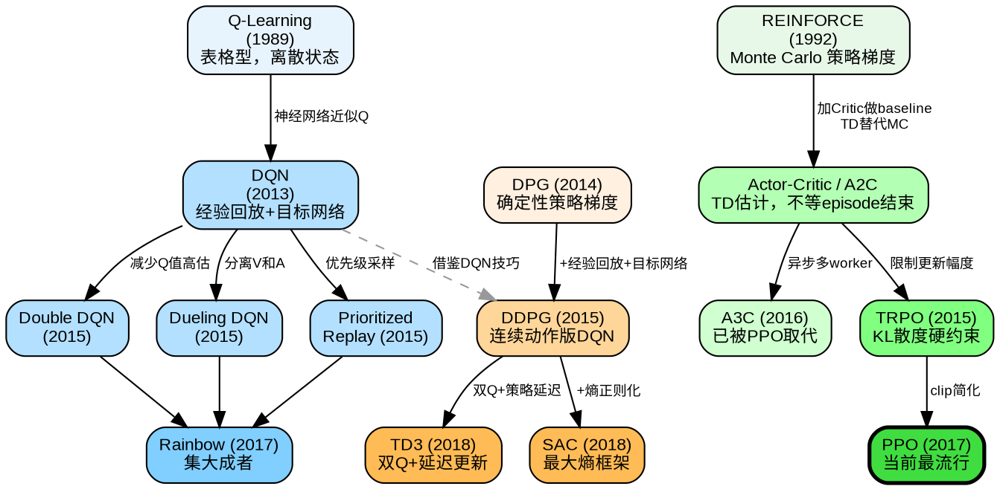

# Reinforcement Learning Algorithm Evolution



## Three Main Branches

| Branch | Representatives | Action Space | Key Idea |
|--------|----------------|--------------|----------|
| Value-Based | Q-Learning → DQN → Rainbow | Discrete | Learn Q(s,a), pick argmax |
| On-Policy Actor-Critic | REINFORCE → A2C → PPO | Discrete / Continuous | Learn policy directly, Critic reduces variance |
| Off-Policy Actor-Critic | DPG → DDPG → TD3 / SAC | Continuous | Reuse old data (replay buffer) + Actor-Critic |

## Evolution Timeline

### Value-Based

| Method | Year | Key Innovation |
|--------|------|----------------|
| Q-Learning | 1989 | Tabular TD learning |
| DQN | 2013 | Neural network + experience replay + target network |
| Double DQN | 2015 | Reduce Q-value overestimation |
| Dueling DQN | 2015 | Separate V(s) and A(s,a) streams |
| Prioritized Replay | 2015 | Sample important transitions more often |
| Rainbow | 2017 | Combine all above improvements |

### On-Policy Actor-Critic

| Method | Year | Key Innovation |
|--------|------|----------------|
| REINFORCE | 1992 | Monte Carlo policy gradient |
| Actor-Critic / A2C | 2016 | Add Critic as baseline, TD replaces MC (concept ~2000, A2C formalized with A3C) |
| A3C | 2016 | Asynchronous parallel workers (now obsolete) |
| TRPO | 2015 | KL divergence constraint on policy update |
| PPO | 2017 | Simple clip replaces KL constraint, most popular today |

### Off-Policy Actor-Critic

| Method | Year | Key Innovation |
|--------|------|----------------|
| DPG | 2014 | Deterministic policy gradient theorem |
| DDPG | 2015 | DPG + DQN tricks (replay buffer + target network) |
| TD3 | 2018 | Twin Q-networks + delayed policy update |
| SAC | 2018 | Maximum entropy framework, auto-tuned exploration |

## Key Transitions Explained

- **Q-Learning → DQN**: Table can't handle high-dim states; neural network approximates Q
- **REINFORCE → Actor-Critic**: Single-episode gradient has huge variance; Critic V(s) as baseline reduces it
- **Actor-Critic → TRPO → PPO**: Unconstrained updates can destroy policy; clip limits step size
- **DQN → DDPG**: DQN only works for discrete actions; DPG enables continuous control
- **DDPG → SAC**: DDPG is brittle; entropy regularization gives robust exploration

## This Project's Coverage

```
Value-Based:           Q-Learning ✓  →  DQN ✓
On-Policy:             REINFORCE ✓  →  PPO ✓
Off-Policy:            SAC ✓
```

---

# 强化学习算法演化路线


## 三大分支

| 分支 | 代表方法 | 动作空间 | 核心思想 |
|------|---------|---------|---------|
| 基于价值 | Q-Learning → DQN → Rainbow | 离散 | 学 Q(s,a)，选最大值 |
| On-Policy Actor-Critic | REINFORCE → A2C → PPO | 离散/连续 | 直接学策略，Critic 降方差 |
| Off-Policy Actor-Critic | DPG → DDPG → TD3 / SAC | 连续 | 复用旧数据（经验回放）+ Actor-Critic |

## 演化时间线

### 基于价值

| 方法 | 年份 | 关键创新 |
|------|------|---------|
| Q-Learning | 1989 | 表格型 TD 学习 |
| DQN | 2013 | 神经网络 + 经验回放 + 目标网络 |
| Double DQN | 2015 | 减少 Q 值高估 |
| Dueling DQN | 2015 | 分离 V(s) 和 A(s,a) |
| Prioritized Replay | 2015 | 优先采样重要经验 |
| Rainbow | 2017 | 集以上所有改进于一体 |

### On-Policy Actor-Critic

| 方法 | 年份 | 关键创新 |
|------|------|---------|
| REINFORCE | 1992 | Monte Carlo 策略梯度 |
| Actor-Critic / A2C | 2016 | 加 Critic 做 baseline，TD 替代 MC（概念 ~2000，A2C 随 A3C 论文正式提出）|
| A3C | 2016 | 异步并行 worker（现已过时）|
| TRPO | 2015 | KL 散度约束策略更新幅度 |
| PPO | 2017 | 用 clip 简化 KL 约束，当前最流行 |

### Off-Policy Actor-Critic

| 方法 | 年份 | 关键创新 |
|------|------|---------|
| DPG | 2014 | 确定性策略梯度定理 |
| DDPG | 2015 | DPG + DQN 技巧（经验回放 + 目标网络）|
| TD3 | 2018 | 双 Q 网络 + 延迟策略更新 |
| SAC | 2018 | 最大熵框架，自动调节探索 |

## 关键演化解释

- **Q-Learning → DQN**：表格无法处理高维状态；神经网络近似 Q
- **REINFORCE → Actor-Critic**：单 episode 梯度方差巨大；Critic V(s) 做 baseline 降方差
- **Actor-Critic → TRPO → PPO**：不约束的更新会毁掉策略；clip 限制步长
- **DQN → DDPG**：DQN 只能处理离散动作；DPG 支持连续控制
- **DDPG → SAC**：DDPG 脆弱易崩；熵正则化带来稳定探索

## 本项目覆盖

```
基于价值:              Q-Learning ✓  →  DQN ✓
On-Policy:            REINFORCE ✓  →  PPO ✓
Off-Policy:           SAC ✓
```
