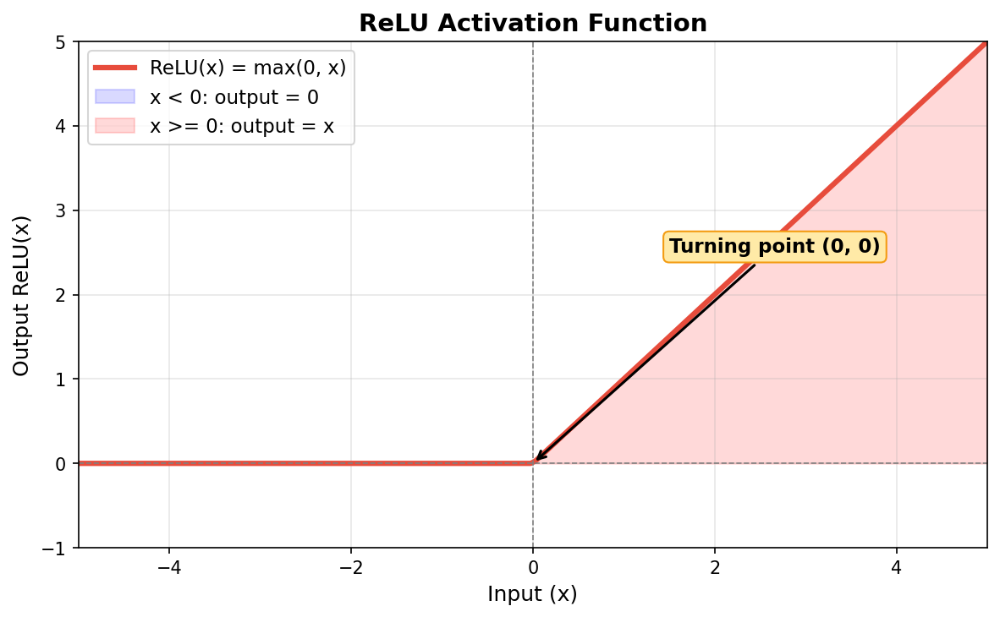

# Why ReLU is Needed Between Layers

## What is ReLU?

ReLU (Rectified Linear Unit) is a simple activation function:

$$\text{ReLU}(x) = \max(0, x)$$

- Positive values pass through unchanged
- Negative values become 0



## Why is it necessary?

### Without ReLU: multiple linear layers collapse into one

Consider two linear layers without any activation:

$$h = xW_1 + b_1$$
$$q = hW_2 + b_2$$

Substituting the first equation into the second:

$$q = (xW_1 + b_1)W_2 + b_2 = x(W_1 W_2) + (b_1 W_2 + b_2)$$

This is still in the form $q = xW' + b'$, where $W' = W_1 W_2$ and $b' = b_1 W_2 + b_2$.

**Conclusion:** Two linear layers without activation are mathematically equivalent to a single linear layer. No matter how many linear layers you stack, they can always be merged into one.

### With ReLU: non-linearity is introduced

$$h = \text{ReLU}(xW_1 + b_1)$$
$$q = hW_2 + b_2$$

After ReLU "bends" the output of the first layer (zeroing out negatives), the two expressions can no longer be collapsed into a single linear transformation.

This allows the network to learn **non-linear relationships** (curves, complex boundaries), greatly increasing its expressive power.

## In the Qnet code

```python
def forward(self, x):
    x = F.relu(self.fc1(x))   # Linear + ReLU (introduces non-linearity)
    return self.fc2(x)         # Linear only (no ReLU, because Q-values can be negative)
```

- **First layer uses ReLU:** to break linearity and enable feature extraction.
- **Last layer has no ReLU:** because Q-values can be negative (e.g., penalties), and ReLU would clip them to 0.

## One-sentence summary

ReLU prevents multiple layers from collapsing into a single linear layer, giving deep networks the ability to approximate complex non-linear functions.

---

# 为什么层与层之间需要 ReLU

## 什么是 ReLU？

ReLU（修正线性单元）是一个简单的激活函数：

$$\text{ReLU}(x) = \max(0, x)$$

- 正值原样通过
- 负值变为 0


## 为什么必须要它？

### 没有 ReLU：多层线性层会坍缩为一层

考虑两层没有激活函数的线性层：

$$h = xW_1 + b_1$$
$$q = hW_2 + b_2$$

把第一个式子代入第二个：

$$q = (xW_1 + b_1)W_2 + b_2 = x(W_1 W_2) + (b_1 W_2 + b_2)$$

结果仍然是 $q = xW' + b'$ 的形式，其中 $W' = W_1W_2$，$b' = b_1W_2 + b_2$。

**结论：** 没有激活函数的两层线性层，在数学上等价于一层线性层。无论你堆多少层线性层，都可以合并成一层。

### 有 ReLU：引入了非线性

$$h = \text{ReLU}(xW_1 + b_1)$$
$$q = hW_2 + b_2$$

ReLU 将第一层输出中的负值"截断"为 0 后，两个表达式再也无法合并成一个简单的线性变换。

这样网络就能学习**非线性关系**（曲线、复杂边界），表达能力大大增强。

## 在 Qnet 代码中

```python
def forward(self, x):
    x = F.relu(self.fc1(x))   # 线性变换 + ReLU（引入非线性）
    return self.fc2(x)         # 仅线性变换（不加 ReLU，因为 Q 值可以为负）
```

- **第一层用 ReLU：** 打断线性关系，让网络具备特征提取能力。
- **最后一层不用 ReLU：** 因为 Q 值可以是负数（比如惩罚），加了 ReLU 就无法输出负值。

## 一句话总结

ReLU 防止多层网络退化为单层线性模型，让深层网络能够逼近复杂的非线性函数。
